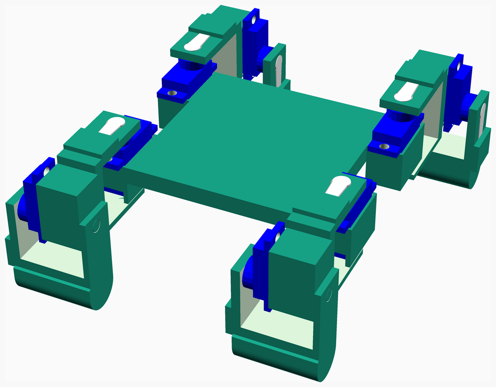
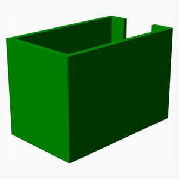
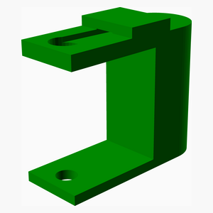
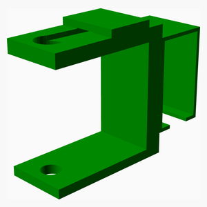
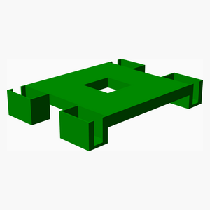
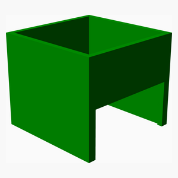

# Hardware

---
## Table of Contents
1. [Parts list](#Parts_list)
1. [Main Assembly](#main_assembly)

[Top](#TOP)

---

## Parts list
| Main | TOTALS |  |
|---:|---:|:---|
|  | | **3D printed parts** |
| &nbsp;&nbsp;4&nbsp; |  &nbsp;&nbsp;4&nbsp; | &nbsp;&nbsp;base_holder.stl |
| &nbsp;&nbsp;4&nbsp; |  &nbsp;&nbsp;4&nbsp; | &nbsp;&nbsp;foot.stl |
| &nbsp;&nbsp;4&nbsp; |  &nbsp;&nbsp;4&nbsp; | &nbsp;&nbsp;leg.stl |
| &nbsp;&nbsp;1&nbsp; |  &nbsp;&nbsp;1&nbsp; | &nbsp;&nbsp;main_body.stl |
| &nbsp;&nbsp;1&nbsp; |  &nbsp;&nbsp;1&nbsp; | &nbsp;&nbsp;prop.stl |
| &nbsp;&nbsp;14&nbsp; | &nbsp;&nbsp;14&nbsp; | &nbsp;&nbsp;Total 3D printed parts count |

[Top](#TOP)

---

## Main Assembly
### 3D Printed parts

| 4 x base_holder.stl | 4 x foot.stl | 4 x leg.stl |
|---|---|---|
|  |  |  

| 1 x main_body.stl | 1 x prop.stl |
|---|---|
|  |  

### Assembly instructions

[Top](#TOP)
