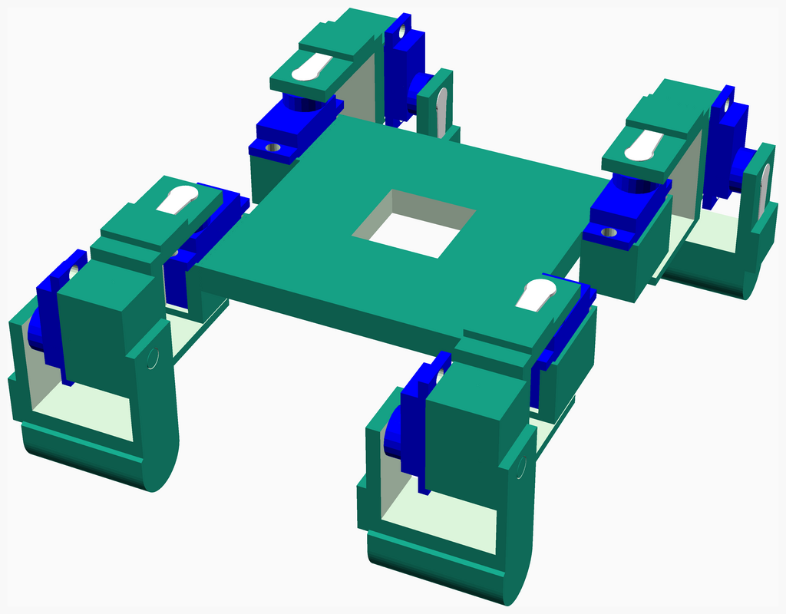

# Hardware

---
## Table of Contents
1. [Parts list](#Parts_list)
1. [Leg Foot Assembly](#leg_foot_assembly)
1. [Main Assembly](#main_assembly)

[Top](#TOP)

---

## Parts list
| 4 x Leg&nbsp;Foot | Main | TOTALS |  |
|---:|---:|---:|:---|
|  |  | | **3D printed parts** |
| &nbsp;&nbsp;4&nbsp; | &nbsp;&nbsp;.&nbsp; |  &nbsp;&nbsp;4&nbsp; | &nbsp;&nbsp;foot.stl |
| &nbsp;&nbsp;4&nbsp; | &nbsp;&nbsp;.&nbsp; |  &nbsp;&nbsp;4&nbsp; | &nbsp;&nbsp;leg.stl |
| &nbsp;&nbsp;.&nbsp; | &nbsp;&nbsp;1&nbsp; |  &nbsp;&nbsp;1&nbsp; | &nbsp;&nbsp;main_body.stl |
| &nbsp;&nbsp;8&nbsp; | &nbsp;&nbsp;1&nbsp; | &nbsp;&nbsp;9&nbsp; | &nbsp;&nbsp;Total 3D printed parts count |

[Top](#TOP)

---

## 4 x Leg Foot Assembly
### 3D Printed parts

| 4 x foot.stl | 4 x leg.stl |
|---|---|
|  |  

### Assembly instructions

1. Remove support material from leg and foot parts
2. Take the tab/joint for each servo and insert it into the slot on the leg and foot parts
3. Insert a servo into the holder on the leg part
4. Attach the foot part to the servo that was inserted into the leg part (this will require some force)

[Top](#TOP)

---

## Main Assembly
### 3D Printed parts

| 1 x main_body.stl |
|---|
|  

### Sub-assemblies

| 4 x leg_foot_assembly |
|---|
|  

### Assembly instructions

1. Remove support material from main body part
2. Insert a servo motors into each of the corner holders
3. Attach the leg/foot assembly to each servo on the main body

[Top](#TOP)
